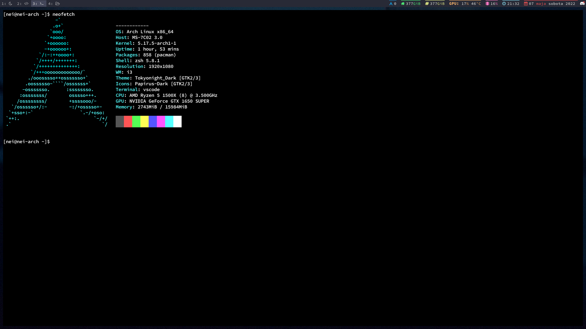

# Gterm

Graphically emulated terminal emulator currently working only on linux.



# Setup

Gterm uses a graphic library called [pixel](https://github.com/faiface/pixel) which underneath uses OpenGL. So you'll need OpenGL development libraries for compilation.

```
$ make build
$  ./gterm
```

# What's working

Currently there are a lot of things to do. The things that work are:

- ANSI escape sequences (almost mostly)
- Support for colors
- Font loader
- Scrolling

# TODO

- Copying and pasting
- Selection
- Mouse modes
- Private mode
- File config
- Multiple font styles
- Tabs
- Support for windows
- Better unicode support

And a lot of more...
